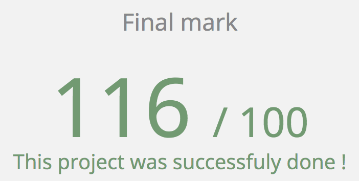

# École 42

## LibFT

**[CLICK HERE FOR A MORE UP TO DATE VERSION](https://gitlab.com/jraleman/libft)**

This projects seeks to build on the concepts learned during the c piscine
(bootcamp), to code a library of useful functions that will be allowed to be
reused in future projects. Because we don't have access to those
highly useful standard functions, we have to re-write those functions,
to understand them and to learn how to use them currently.

## Getting Started

### Compiling

Run the following commands:

* To compile
	- `make`
* To remove objects:
	- `make clean`
* To remove objects and binary file (program):
	- `make fclean`
* To re-compile:
	- `make re`

### Executing

To test the library, compile with your program. i.e.

`./program libft.a`
